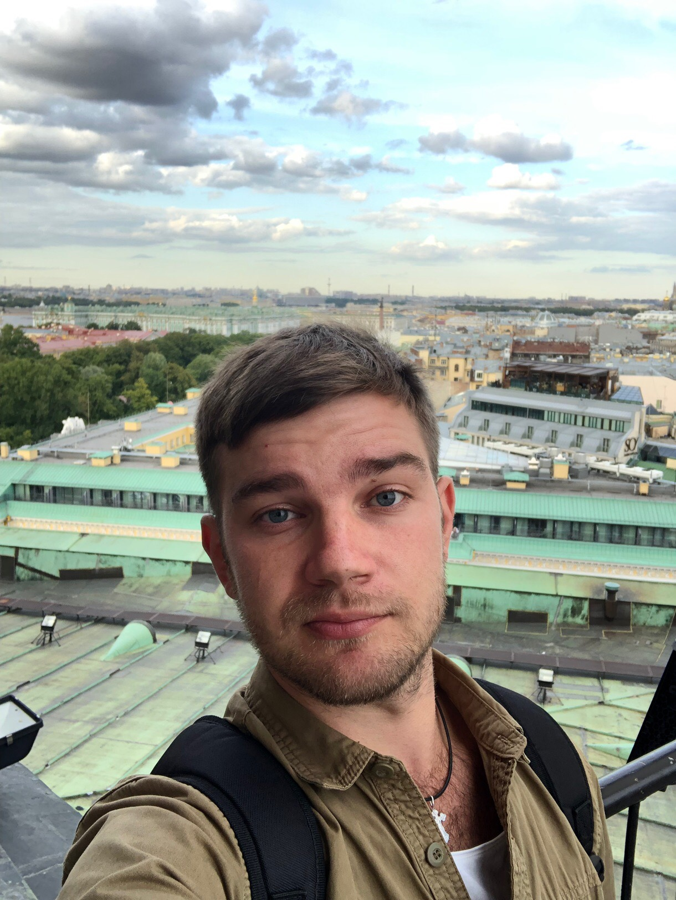

# Обо мне
 
### Здравствуйте, моё имя Вадим. Очень рад, что вы посетили мой сайт-визитку, раз это случилось, думаю я вызвал у Вас интерес к своей персоне.
###  Я начинающий Frontend-developer, обучаюсь в данный момент в онлайн-школе [Нетология](https://netology.ru/). В период обучения работаю в немецкой компании "Linde" слесарем по сбору металлоконструкций, занимаюсь изготовлением теплообменных аппаратов по переработке природного газа, работа интересная и ответственная.
### До этого работал на "РЖД" оператором поста централизации, занимался построением маршрутов, руководством маневровой работы.
### Имею техническое образование по специальности "Инженер по ремонту и эксплуатации, подвижного состава".
### Как вы могли понять по краткому описанию, что я далёк от сферы-IT, но тем не менее, я твердо решил переобучиться и освоить новую профессию, ведь за этим будущее.
